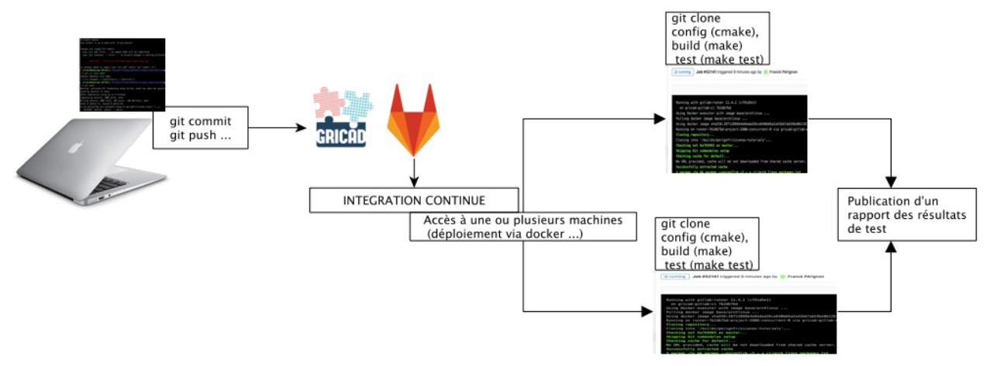
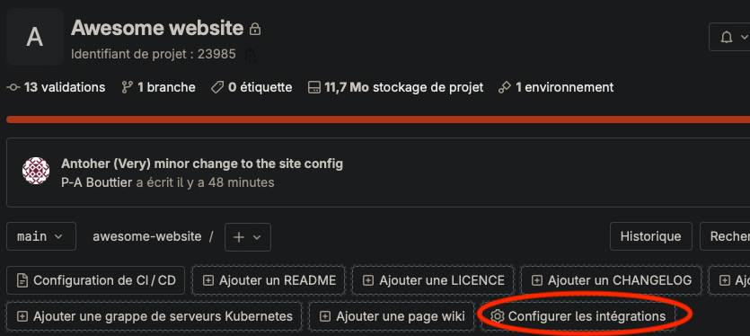

<!-- _class: titlepage -->
<style scoped>
margin-left: 10%;

</style>


# L'intégration/déploiement continue
## Automatisation des tâches avec GitLab

### GitLab@CNRS - 09-10/01/2024
#### [Pierre-Antoine Bouttier](mailto:pierre-antoine.bouttier@univ-grenoble-alpes.fr)

---
# TOC

<!-- _class: cool-list -->

1. *La CI/CD, concepts et mise en place*
2. *Publier un site web avec GitLab*
   1. *Les générateurs de site statique*
   2. *GitLab Pages*
   3. *Mise en œuvre de la CI/CD*

---
# TOC

<!-- _class: cool-list -->

1. ***La CI/CD, concepts et mise en place***
2. *Publier un site web avec GitLab*
   1. *Les générateurs de site statique*
   2. *GitLab Pages*
   3. *Mise en œuvre de la CI/CD*

---
# Qu'est ce que c'est ?

**Concept**
- Continuous Integration : pratique consistant **à associer à chaque modification des sources** une séries d'opérations qui seront exécutées automatiquement.
- Continuous deployment : pratique consistant **à automatiser les actions de déploiement** d'applications

---
# Intérêts

- S’assurer que le résultat de nouvelles modifications n’introduit pas de régression du code
- Anticiper différents types d’utilisation du code.
- Faciliter les développements au quotidien, les collaborations
- Identifier et corriger les erreurs plus facilement et plus rapidement
- Anticiper, planifier, tester différents environnements (debug/release, OS, paramètres ...)
- Déployer le code, fournir des "images" prêtes à l'emploi (Docker, Singularity ...)
- Économiser du temps pour les développeurs, réduire le "time-to-release" ou le "time-to-new-features"

---
# Par quelle magie ?

À chaque push vers le serveur, des tâches pré-définies par les développeurs sont exécutées.

<center>



</center>

---
# Quelques exemples

<center>


</center>

Ici, il y a du **déploiement continu** aussi. Mais les mécanismes sont les mêmes que pour la CI. Seule la finalité change.

---
# Comment mettre la CI/CD en place ? 

**Deux ingrédients**
- L'activation d'un exécuteur (ou runner). 
- Le fichier `.gitlab-ci.yml`, qui contiendra **la description des tâches à exécuter** lorsque que vous modifiez votre dépôt Git 
- https://docs.gitlab.com/ee/ci/quick_start/

--- 
# Les exécuteurs (ou runners)

Les exécuteurs sont des processus, qui tournent sur une machine (virtuelle ou non) indépendamment de GitLab et ont pour mission : 
- **de surveiller (très) régulièrement** toute modification du dépôt de votre projet
- **de lancer les tâches** que vous avez définies, sur la machine sur laquelle ils s'exécutent

--- 
# Les exécuteurs (ou runners)
 
### Les exécuteurs partagés

- Installés et maintenus par les administrateurs de la plateforme Gitlab
- **Disponibles pour tous les projets de la plateforme**
- Comme partagés, ils peuvent parfois mettre du temps à détecter les modifications et lancer les tâches

### Les exécuteurs dédiés

- [Installation sur une machine dédiée, par vos soins](https://docs.gitlab.com/runner/install/)
- Dédiés à vos projets, donc **rapides et toujours disponibles**
- Et peuvent gérer des tâches spécifiques (contrôle de l'environnement sur la machine sur laquelle ils sont installés)

---
# Le fichier `.gitlab-ci.yml`

**Fichier au format YAML.**
```yaml
build-job:
  stage: build
  script:
    - echo "Hello, $GITLAB_USER_LOGIN!"

test-job1:
  stage: test
  script:
    - echo "This job tests something"

deploy-prod:
  stage: deploy
  script:
    - echo "This job deploys something from the $CI_COMMIT_BRANCH branch."
  environment: production
```

---
# Le fichier `.gitlab-ci.yml`

- Beaucoup de possibilités...
- ... et d'exemples 
- [La syntaxe de référence](https://docs.gitlab.com/ee/ci/yaml/)

<center>



</center>

--- 
# Et dans la suite ? 

Nous utiliserons les runners partagés et je vous fournirai les fichiers `.gitlab-ci.yml`. 


---
# TOC

<!-- _class: cool-list -->

1. *La CI/CD, concepts et mise en place*
2. ***Publier un site web avec GitLab***
   1. ***Les générateurs de site statique***
   2. *GitLab Pages*
   3. *Mise en œuvre de la CI/CD*

---
# Comment fait-on un site web ? 

- Il faut d'une part le construire... :
  - Avoir du contenu (texte, audio, vidéo, images, etc.)...
  - ...agencé suivant des standards qui permettent à tout le monde d'y accéder (via leurs navigateurs) : CSS (pour la forme), HTML (pour la structure)...
  - ...le tout agrémenté de fonctions supplémentaires, implémentées dans des langages de programmation : Javascript, PHP, Python, SQL, etc.  

- ...puis le mettre à disposition : 
  - À l'aide d'un serveur web : Apache, Nginx, etc
  - Qui tourne sur un ordinateur qu'il faut bien configurer...
  - ...y compris en terme de réseau

---
# Va-t-on apprendre tout ça en quelques minutes ?

Non. 

Construire et publier un site web sur mesure est un métier (parfois, plusieurs).  

---
# SGC, SSG, kezako ?

Il existe des systèmes (logiciels) qui permettent de **construire** des sites web (=pages HTML) **simplement**

- Les Systèmes de Gestion de Contenu (SGC ou CMS en anglais) : 
  - Ensemble d'outils pour créer et gérer des sites web complets et complexes
  - Souvent **dynamiques**, i.e. le rendu (=pages HTML) est généré lorsque le visiteur le consulte
  - Nécessitent, quasiment tout le temps, des bases de données
  - Exemples : wordpress, drupal

---
# SGC, SSG, kezako ?

Les Générateurs de sites statiques (SSG en anglais) : 
- **Construit**, en quelques commandes/scripts, **un site web à partir de fichiers textes (contenu et templates/css) et médias**
- Le site construit est **statique** (pas d'interactions avec les visiteurs)
- Les données d'entrée sont stockées dans un système de fichiers (pas de BDD)
- Exemples : **hugo**, jekyll, pelican, gatsby, eleventy

---
# Pourquoi nous intéressons-nous aux SSGs ? Pros

Les avantages 
- **Légèreté et rapidité** : Les pages HTML sont déjà écrites et stockées, il n'y a pas besoin de les construire à la volée
- **Sécurité** : faible surface d'attaque
- **Contrôle de version du contenu** : seuls des fichiers textes (et médias) sont nécessaires, donc on peut utiliser Git (et GitLab) pour gérer l'évolution du site. 
- **Maintenance légère** : comparé à un CMS, la maintenance du SSG en lui-même est nulle. 
Quand ne pas les utiliser : 
- Contenu fortement dynamique
- Traitement d'entrées utilisateurs (**e.g.** formulaires)
- Nécessitent quelques compétences (mais les CMS aussi)
- **Nota Bene** : Site statique ≠ [petit site](https://gricad-doc.univ-grenoble-alpes.fr/hpc/)

---
# Les différents SSGs

Comme déjà mentionné, il existe pléthore de SSGs
- Ils peuvent être écrits dans différents langages : python, php, javascript, etc.
- Fonctionnements souvent semblables
- Nous utiliserons aujourd'hui [le SSG Hugo](https://gohugo.io/) : communauté active (plein d'avantages à ça), s'installe assez facilement sur toutes les plateformes, rapide, a pas mal de fonctionnalités, open source. 

---
<!-- _class: transition -->

Création du site

---
# En pratique

- Si possible, [installez hugo sur votre machine](https://gohugo.io/installation/)
- [Clonez ce dépôt](https://gricad-gitlab.univ-grenoble-alpes.fr/git_cnrs/formation-2024/awesome-website)
- Dans un terminal, placez-vous dans le dossier du dépôt et lancez `hugo serve`
- Explorons ensemble le contenu du dépôt

---
# Mais où sont nos pages web ? 

Jusqu'à maintenant, nous avons visualisé le site web généré par Hugo. Mais où est-il, en terme de fichiers ?
- Nulle part :) Pour générer les fichiers qui seront publiés par un serveur web, il faut lancer la commande `hugo -D`
- Un nouveau dossier, dans votre projet, a été créé : `public/`. Allons y faire un tour. 

---
<!-- _class: transition -->

Nous allons voir comment installer et configurer un serveur web apache sur un serveur dédié :)

---
# TOC

<!-- _class: cool-list -->

1. *La CI/CD, concepts et mise en place*
2. ***Publier un site web avec GitLab***
   1. *Les générateurs de site statique*
   2. ***GitLab Pages***
   3. *Mise en œuvre de la CI/CD*

---
# GitLab Pages, notre sauveur

GitLab Pages: 
- Fonctionnalité disponible pour chaque projet GitLab
- **Activable en activant la CI/CD sur votre projet**
- Permet de (construire) et publier un site web (activation d'un serveur web)
- Par défaut, utilise le dossier `/public` de votre projet et sert les pages web qu'il contient. 
- Acccessible, sur la page de votre projet en cliquant sur ***Déploiements/Pages***

---
# TOC

<!-- _class: cool-list -->

1. *La CI/CD, concepts et mise en place*
2. ***Publier un site web avec GitLab***
   1. *Les générateurs de site statique*
   2. *GitLab Pages*
   3. ***Mise en œuvre de la CI/CD***

---
# Activation - Démo

- Création du fichier `gitlab-ci.yml` (cf. dépôt du site web)
- Activation du runner (***Paramètres/CICD/Exécuteurs***)

---
# Mise en pratique 

- Sur le dépôt du site web, créez une branche à votre nom
- Faites des modifs dans cette branche, dans les dossiers `content/en/home` et `content/fr/home`
- Synchronisez vos modifications et quand vous êtes satisfaits faites une demande de fusion dans `main`
- Reviewez une demande de fusion faites par quelqu'un d'autre. 

---
<!-- _class: transition -->

Conclusion

---
# La CI/CD

- Outil GitLab pour automatiser des tâches, déclenché lors de modifications du dépôt Git
- Nous l'avons mis en place pour construire et publier un site web...
- ... Mais les usages et intérêts sont nombreux ! 
- Il existe beaucoup d'exemples de CI/CD sur le web, n'hésitez à fouiller pour trouver votre bonheur ! 

---
<!-- _class: transition -->

Merci de votre attention