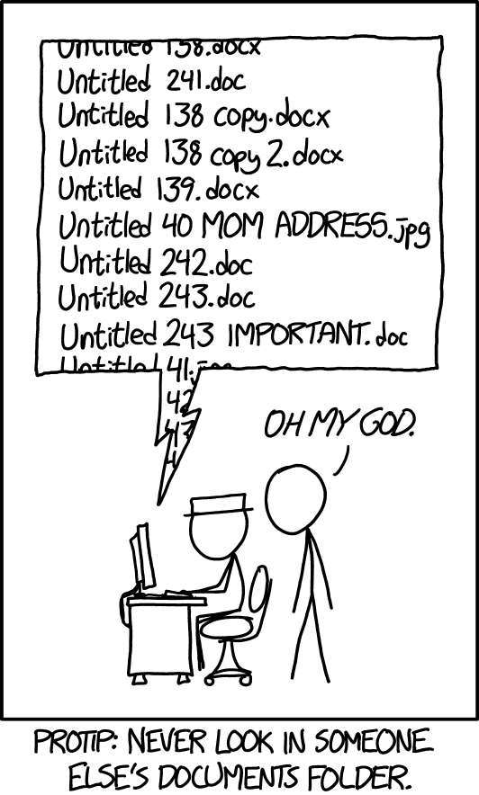
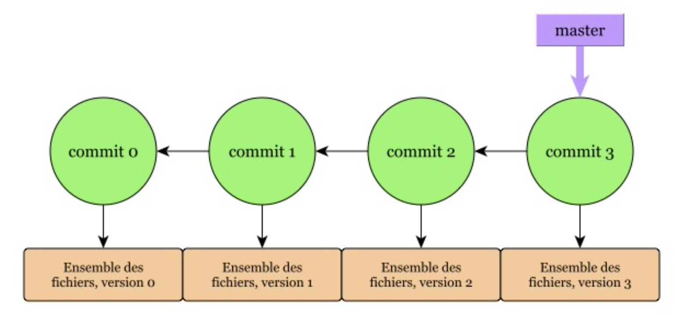
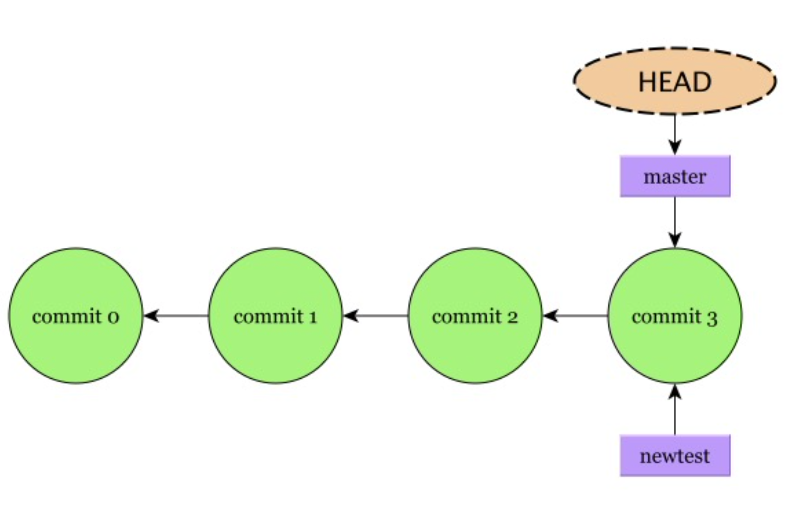
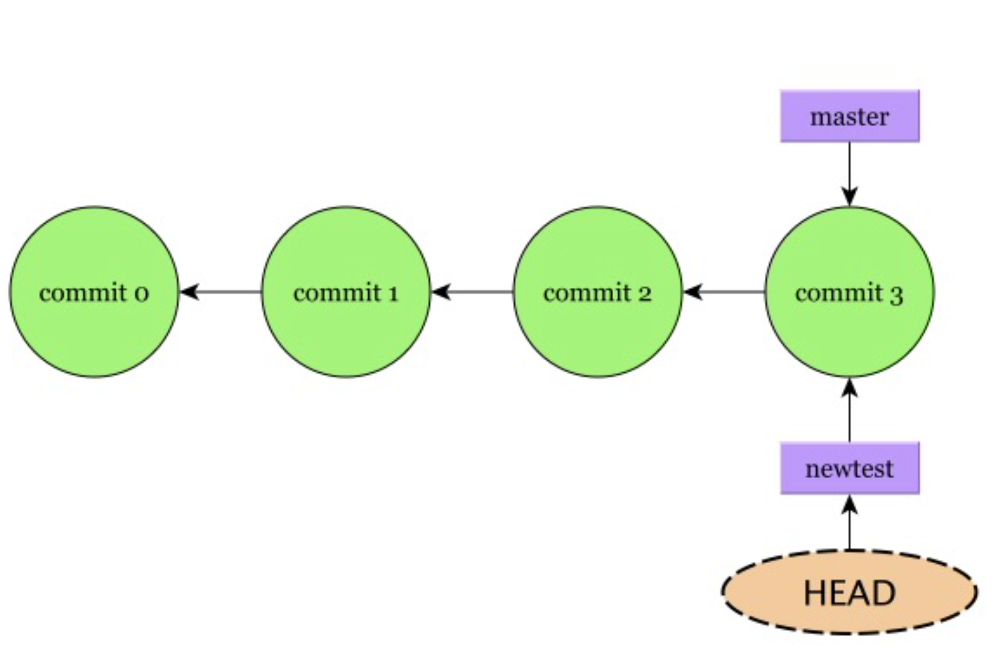
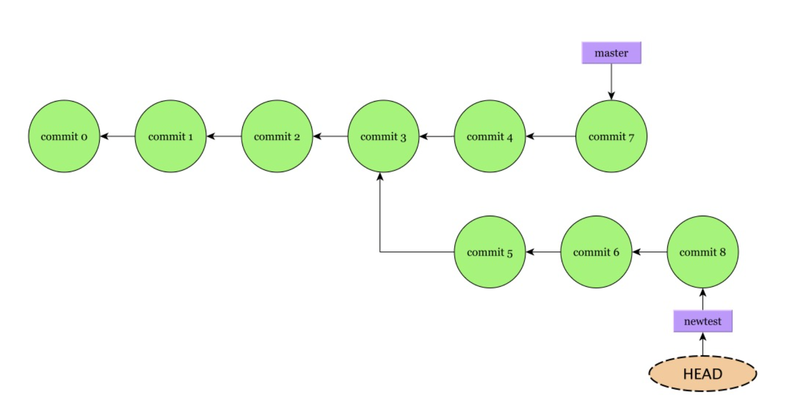
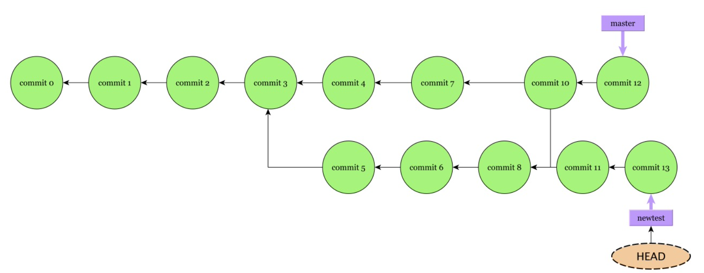
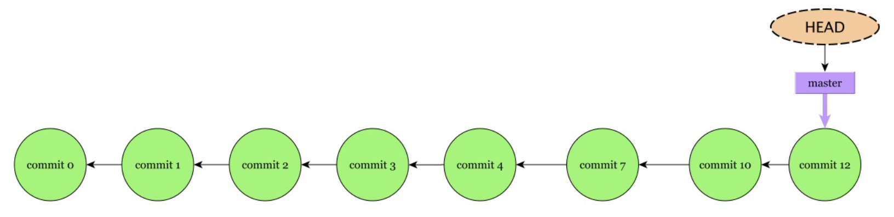

<!-- _class: titlepage -->

<style scoped>
margin-left: 10%;

</style>


# Introduction à Git
## Cours et mise en pratique

### GitLab@CNRS - 09-10/01/2024
#### [Pierre-Antoine Bouttier](mailto:pierre-antoine.bouttier@univ-grenoble-alpes.fr)

---
# TOC

<!-- _class: cool-list -->

1. *Les gestionnaires de versions*
2. *Les concepts et commandes de base `git`*
3. *Naviguer dans l'historique d'un projet*
4. *Comprendre les branches*

---
# TOC

<!-- _class: cool-list -->

1. ***Les gestionnaires de versions***
2. *Les concepts et commandes de base `git`*
3. *Naviguer dans l'historique d'un projet*
4. *Comprendre les branches*

---
# Quelques situations rencontrées

<div class="columns-center" align="center">
<div>     


</div>
<div>


</div>

---
 <!-- _class: cite -->     

Your closest collaborator is you six months ago, but you don’t reply to emails.

<div class="cite-author" data-text="Paul Wilson, UW-Madison">

---
# Un gestionnaire de quoi ?

- Un gestionnaire de version de code vous permet de : 
  - **Construire l'historique**, comme bon vous semble, de toutes les évolutions d'un ensemble de fichiers (principalement textuels)
  - De **naviguer** dans cet historique
  - **d'expérimenter** des choses en parallèle, dans le même fichier, ou plusieurs
  - Et d'atténuer drastiquement la peur de *détruire des trucs*

---
# Les gestionnaires de versions de code (VCS en anglais)

Initialement prévus pour les **codes source logiciels**, leur versatilité actuelle en font des outils précieux pour gérer tous types de productions incluant du texte ayant vocation à évoluer dans le temps :

- Documentation
- Rapport technique, mémoires 
- Sites webs ou présentations (comme celle-ci) 
- ...

--- 
# Pourquoi Git ?

Il existe plusieurs VCS : cvs, subversion, mercurial, git, etc.

Les avantages de git :
- Marche online et offline
- Conçu pour le travail largement collaboratif
- Rapide à l'exécution
- Le plus utilisé au monde : 
  - Documentations et aides innombrables
  - Outils connexes très puissants et développements très actif
- **Gitlab**, github
- ...

---
# TOC

<!-- _class: cool-list -->

1. *Les gestionnaires de versions*
2. ***Les concepts et commandes de base `git`***
3. *Naviguer dans l'historique d'un projet*
4. *Comprendre les branches*

---
# Les concepts fondamentaux et commandes de base

<!-- <center> -->


<!-- </center> -->

---
# Les premiers pas

Git installé, nous allons l'utiliser depuis la ligne de commande (terminal, PowerShell). Même fonctionnement sous Windows, Mac OS et Linux : 
```shell
$ git <command> <arguments>
```
Pour obtenir de l'aide : 
```shell
$ git help
$ git help <command>
```

---
# La configuration de git 

Renseignons quelques informations (identiques à GitLab si possible, surtout pour le mail) : 

```shell
$ git config --global user.name "John Doe"
$ git config --global user.email johndoe@example.com  
$ git config --global core.editor code # ou gedit, ou ce que vous utilisez comme éditeur de texte
```

Git va écrire dans le fichier `~/.gitconfig` 

Mais il est possible de spécifier des informations différentes pour chaque projet. Elles seront prioritaires sur la configuration globale. 

Git va parfois nous inviter à saisir du texte, c'est là que la configuration de l'éditeur de texte de référence intervient. 

---
# Le premier dépôt - git init

**Dépôt/Repository** : dossier contenant l'ensemble de fichiers dont on veut suivre l'évolution ainsi que les fichiers nécessaires au fonctionnement de Git.

```shell
$ cd # on retourne dans notre /home
$ mkdir new_project # On crée le dossier qui contiendra nos fichiers à suivre
$ cd new_project # On va dedans
$ ls -a # On vérifie qu'il n'y a aucun fichier, même "caché"
$ git init . # git init sans le '.' fait la même chose
$ ls -a # Quelque chose est apparu
```
ou
```shell
$ cd
$ git init new_project
```
---
# Le premier dépôt - git init

La commande `git init` peut très bien être utilisée dans un dossier contenant déjà des fichiers et dossiers. 

```shell
$ cd ../example_project
$ git init . 
```

`git` reconnaît s'il est dans un dépôt si le dossier `.git` est présent dans le dossier où l'on se trouve ou **dans un dossier parent**.

`git` ne versionne que des fichiers. Un dossier vide ne sera pas considéré par `git`.

---
# Votre nouvel ami - `git status`

`git status` vous donnera plein d'informations sur l'état de votre dépôt. **À utiliser sans modération.** 

```shell
$ cd ~/example_project
$ git status
$ touch first_file.md
$ git status
```
***Git est globalement bavard, mais ses messages vous indiquent souvent la marche à suivre si vous êtes perdus et/ou bloqués.***

---
# Surveillance des fichiers - git add

Nous voulons maintenant dire à Git quel(s) fichier(s) doit-il surveiller pour enregistrer leurs modifications par la suite : 

```shell
$ git add first_file.md
$ git status
```
Maintenant, éditez et sauvegardez le fichier `first_file.md`. Après édition :

```shell
$ cat first_file.md
$ git status
$ git restore first_file.md # commande bonus assez peu utilisée. Que fait-elle ?
$ cat first_file.md 
$ git status
```

---
# Sauvegarde des modifications - git commit

Notre fichier est suivi, maintenant, nous voulons sauvegarder son état : 
```
$ git commit -m "message"
$ git status
```
C'est tout.

**Un commit indique l'état de l'ensemble des fichiers du dépôt à un instant donné (instantané ou snapshot).**

**La zone d'index/staging** (entre deux commits, fichiers concernés part la commande `git add`) stocke **les informations (nouveau fichier, fichier supprimé, modifications apportées dans les fichiers déjà indexés) qui feront parties du prochain commit/instantané.** 

---
# Remarque sur `git commit`

La commande `git commit`, sans option, va ouvrir l'éditeur renseigné dans la variable d'environnement `EDITOR`. 

Par convention, dans ce fichier texte, la première ligne est une description courte du `commit` (i.e. des modifications que vous voulez voir dans votre historique) suivie d'une ligne vide puis d'une description plus complète. 

---
# En avant

On édite et sauvegarde `first_file.md` à nouveau. Nous voulons sauvegarder nos modifications : 
```shell
$ git commit -m "Deuxième édition de first_file.md"
```
Que se passe-t-il ? 

---
# Marche arrière 

Nous n'avons pas dit à Git quelles sont les informations à intégrer au prochain commit.
```shell
$ git add first_file.md
$ git commit -m "Deuxième édition"
```
Avant chaque commit, il faut dire à git quels changements du dossier de travail sauvegarder, et c'est le rôle de la commande `git add`.

---
# Un petit schéma


- Un bon commit est un commit **atomique**...
- ...ou qui fait sens (surtout dans le contexte collaboratif)
- La zone de staging (index) permet de préparer le prochain commit

--- 
# Il faut travailler fichier par fichier ? 

```shell
$ touch third_file.md
$ git status
$ git add second_file.md third_file.md
$ git commit -m "Ajout d'un couple de fichiers"
```
Pour les plus pressés (**à utiliser avec précaution**) : 
```shell
$ git add . # Surveille l'ensemble des fichiers sous le dossier courant
$ git commit -m "Je sauvegarde tout"
```
Pour les fichiers déjà connus de Git auparavant
```shell
$ git commit -am "Je sauvegarde les modifs des fichiers que Git connaît déjà"
```

---
# Au sujet des commits 

Les commits sont l'unité atomique d'un dépôt git : 
- **Ne négligez pas** (tout le temps) **le message qui l'accompagne**
- **Il n'y a pas de pratique universelle** sur ce que l'on met dans un commit : une fonctionnalité, une correction, un nouveau paragraphe, un commentaire, etc. 
- Si travail à plusieurs, il est important **de se mettre d'accord sur les pratiques communes** (cf. worflows `git`)
- Les commits sont ce qui va vous permettre de voyager dans le temps : **à vous de gérer les étapes**  

--- 
# TL;DR

```shell
$ cd path/vers/un/dossier_rempli
$ git init .
$ git add fichier_1.py fichier_2.py dossier/fichier3.py
$ git commit -m "Ma première version"
$ ... # On modifie des fichiers existants
$ git commit -am "Ma deuxième version"
$ touch new_file.txt # On crée un fichier
$ git add new_file.txt
$ git commit -m "Ma troisième version"
```

---
# Un petit mot sur les fichiers supprimés

Si vous voulez supprimer un fichier, le supprimer sur votre disque (e.g. commande `rm`) n'indique pas à git que vous voulez le supprimer du dépôt. Il faut également faire : 
```shell
$ git rm fichier_à_supprimer
$ git commit -m "Je supprime un fichier"
```
`git rm` supprime le fichier du dépôt ET du disque si ce n'est déjà fait. 

Si vous voulez supprimer un fichier de votre dépôt (i.e. qu'il ne soit plus compris dans les prochains commits) mais **pas du disque** : 
```shell
$ git rm --cached fichier_à_supprimer
$ git commit -m "Je ne veux plus sauvegarder de modifs dans ce fichier"
```

---
# Indexer toutes les modifications

Il existe une commande pour tout indexer en même temps, fichiers ajoutés, modifiés et supprimés : 
```shell
$ git add -A # ou git add --all
```
***À utiliser avec précaution***

---

**Vous connaissez maintenant 60% des commandes git que j'utilise au quotidien.**

Les 30% restants sont un peu dans la suite et surtout dans la partie gitlab.

---
# TOC

<!-- _class: cool-list -->

1. *Les gestionnaires de versions*
2. *Les concepts et commandes de base `git`*
3. ***Naviguer dans l'historique d'un projet***
4. *Comprendre les branches*

---
# Morceaux d'histoire - git log

Maintenant que nous avons construit un historique, nous voulons le consulter : 
```shell
$ git log
```
Plusieurs remarques : 
- Chaque commit est unique et clairement identifié par une suite barbare de caractères alphanumériques (**hash**).   
- Le dernier commit en date est pointé comme le `HEAD` de la branche `main`...
- Nous voyons l'importance ici des messages de commits : **ils mettent du sens dans l'historique**

---
# Un (premier) petit mot sur le `HEAD`

Le mot-clé `HEAD` est un pointeur de `git` vers le commit actuellement utilisé et son historique lié (=branche). En général, c'est le dernier commit en date.

---
# Comment "revenir" en arrière ? - `git revert`

Vous souhaitez, pour diverses raisons, revenir à un état antérieur de votre historique : `git revert commit0..commitN` !

Cette commande va **inverser** les changements opérés entre le `commit0` et le `commitN`, puis **créer un nouveau commit** qui va remettre les fichiers dans l'état où ils étaient au `commit0`.

À tester : 
- `git revert HEAD^3..HEAD`
- `git revert n°commit..HEAD`

---
# Remarque sur `git revert`

**Dans la plupart des cas, c'est la bonne façon d'annuler des modifications précédentes**, on ne touche pas à l'historique (on l'enrichit), on ne détruit rien du travail accompli.

---
# Comment "revenir" en arrière ? - les autres cas

Annulation des modifications sur un fichier (retour au dernier commit)
```shell
git checkout -- fichier
```
Annulation de la mise dans l'index (`git add`)
```shell
git reset fichier
```
Modification du dernier commit (message et ajout du contenu de l'index en cours)
```shell
git commit --amend
```

**Personnellement**, je préfère éviter au maximum ces méthodes qui *détruisent* toujours quelque chose. 

---
# TOC

<!-- _class: cool-list -->

1. *Les gestionnaires de versions*
2. *Les concepts et commandes de base `git`*
3. *Naviguer dans l'historique d'un projet*
4. ***Comprendre les branches***

---
# Les branches avec Git

Un `commit` est un lien/pointeur vers un instantané de l'état de l'ensemble des fichiers de votre dépôt. Git empile les commits au fil de vos validations pour construire l'historique de vos projets. 

<center>



</center>

Une branche est simplement un lien/pointeur vers un commit particulier (et tout l'historique qu'il implique). Tout dépôt git possède une branche par défaut, nommée souvent **master** ou depuis peu, **main**. 

---
# Pourquoi créer des branches ? 

- Pour tester une nouvelle fonctionnalité...
- ...corriger des bugs...
- ...revenir en arrière...
- ...sans modifier la version actuelle qui est, malgré tout, satisfaisante et/ou utilisée
- **Une nouvelle branche implique une divergence par rapport à notre branche principale.**

--- 
# Créer et utiliser une branche (1/4)

Création de la branche nommée `newtest`
```shell
$ git branch newtest
```
Nous avons créé un nouveau pointeur sur le dernier commit.

<center>



</center>

---
# Un (deuxième) petit sur `HEAD`

<center>


</center>

Par défaut, `HEAD` est **attaché**, c'est à dire que c'est un commit qui se trouve dans une branche.

Parfois, il peut se trouver dans un état **détaché**, i.e. un commit "flottant", hors de tout historique (branches). Nous verrons plus tard comment gérer ce cas de figure.

---
# Créer et utiliser une branche (2/4)

Pour changer de branche : 
```shell
$ git switch newtest # ou git checkout newtest
``` 

<center>



</center>

À partir de maintenant, tous les commits suivants s'empileront sur la branche `newtest` et non plus sur la branche `master`. Notez que `HEAD` pointe bien maintenant sur la branche `newtest`. 

---
# Créer et utiliser une branche (3/4)

Création et changement de branche en une seule opération :
```shell
$ git switch -C newtest # ou git checkout -b newtest
```
Pour avoir la liste des branches et savoir sur laquelle nous sommes positionnés : 
```shell
$ git branch
```

---
# Créer et utiliser une branche (4/4)

Lors du basculement d'une branche à une autre, les fichiers seront modifiés pour se mettre dans l'état du dernier commit de la branche visée. 

<center>



</center>

Au bout d'un moment, on peut vouloir fusionner les branches, c'est à dire intégrer les développements d'une branche **source** dans une autre **cible** 

---
<!-- _class: transition -->

Un peu de pratique

---
# Fusion des branches (1/3)

Dans notre cas, nous voulons intégrer les développements de la source `newtest` dans la cible `master`. 

**On se positionne d'abord sur la branche cible** `master` : 
```shell
$ git switch main # ou git checkout main
```
Puis on fusionne :
```shell
$ git merge newtest
```

S'il n'y a pas de conflits, cela crée un nouveau commit (dit *de fusion*) dans la branche cible `master`.

---
# Fusion des branches (2/3)

À la suite d'une fusion, les deux branches existent toujours et peuvent continuer à évoluer comme elles le faisaient auparavant. 

<center>



</center>

---
# Fusion des branches (3/3)

Pour supprimer une branche que l'on juge inutile :
```shell
$ git branch -d newtest
```

<center>



</center>

---
# Résoudre les problèmes de fusion - les conflits

Lorsque l'on fusionne deux branches, il se peut que Git nous dise qu'il y a des problèmes (**conflits**). Ces conflits peuvent venir de modifications faites sur les mêmes fichiers, aux mêmes lignes dans les deux branches.

Dans le fichier où le conflit se passe, vous verrez quelque chose qui ressemble à : 

```shell
<<<<<<< HEAD
Something
=======
Something else
>>>>>>> newtest
```
---
# Résoudre les problèmes de fusion - les conflits

Il faut alors éditer le fichier à la main pour choisir ce que l'on veut garder. 

Une fois fait, il faut indexer notre modification du fichier (`git add ...`) et faire le commit. Le conflit est alors résolu, la fusion est complète. 

---
<!-- _class: transition -->

Un peu de pratique

---
# Retour vers le futur

Git permet non seulement de construire un historique mais également de voyager dedans.
Nous pouvons retrouver n'importe quel état de tout ou partie du dépôt : 
```shell
$ git checkout <hash de commit> 
```
**Attention** : on ne *revient* pas, sur la branche, au commit indiqué ! On se place dans un commit flottant où les fichiers sont dans l'état où ils étaient au commit indiqué. Si l'on veut continuer avec cet instantané : `git add ...`et `git commit -m ...`.

Pour repartir de ce comit, il faut créer alors une nouvelle branche : 
```bash
$ git switch -C new_beginning
```

--- 
# À retenir - les commandes essentielles

- **Dépôt git** : dossier regroupant l'ensemble des fichiers et dossiers que vous voulez versionner et des fichiers/bases de données dont git a besoin pour fonctionner. Création du dépôt dans un dossier existant : `git init`
- **3 états** pour un fichier dans Git : 
  - **Modifié** : fichier crée/modifié depuis la création du dépôt ou depuis le dernier commit. Pour surveiller ce fichier avec git, `git add`
  - **Indexé/staged** : modifications prêtes à être enregistrées lors du prochain commit `git commit`
  - **Fichier OK** : fichier est déjà dans la base de Git et n'a pas été modifié depuis le dernier commit
- `git status` vous donne toutes les informations sur l'état de votre dépôt. 

---
# À retenir - les branches

- **Une branche est un pointeur/une étiquette vers un commit spécifique**, lui-même le résultat d'un empilement de commits (instantanés de l'état des fichiers de votre dépôt)
- On peut créer une nouvelle branche à l'aide de la commande `git branch <nombranche>` (ou `git switch -C`)
- On liste les branches à l'aide de la commande `git branch`
- On change de branche courante à l'aide de `git checkout <nombranche>`(ou `git switch`)
- On merge la branche Y dans la branche X, en se positionnant dans la branche X et en faisant `git merge Y`
- On supprime une branche à l'aide de `git branch -d <nombranche>`

---
# Les bonnes pratiques

- Git fournit un ensemble de concepts et d'outils pour construire l'historique de votre travail
- Il n'y a pas UNE bonne façon de les utiliser
- Veillez cependant : 
  - À faire des commits *régulièrement*
  - À faire des messages de commits explicites, *i.e.* **donner du sens** à votre historique
  - Ne pas rechigner à **créer des branches** quand c'est nécessaire...
  - ...Et à les supprimer quand elles ne sont plus utiles.

---
# Ce que je n'ai pas présenté

- `git diff`, `git tag`
- Des commandes compliquées (e.g. `git rebase`, `git cherry-pick`) pour réorganiser l'historique
- Comment travailler à plusieurs (peut-être dans la suite ?...)
- **Les alias, le .gitignore, etc.**
- [**Les interfaces graphiques à git**](https://git-scm.com/downloads/guis)

---

<!-- _class: transition -->

# Prêts pour GitLab ?