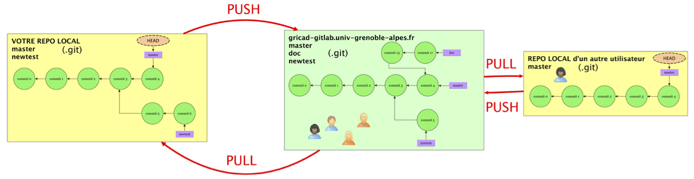
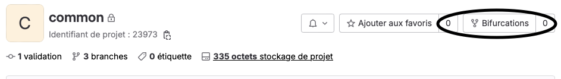

<!-- _class: titlepage -->

<style scoped>
margin-left: 10%;

</style>


# Git & GitLab
## Travailler avec les dépôts distants

### GitLab@CNRS - 09-10/01/2024
#### [Pierre-Antoine Bouttier](mailto:pierre-antoine.bouttier@univ-grenoble-alpes.fr)

---
# TOC

<!-- _class: cool-list -->

1. *Git et les dépôts distants*
2. *Lier un dépôt Git et un projet GitLab*
3. *Le travail collaboratif avec Git et GitLab*

---
# TOC

<!-- _class: cool-list -->

1. ***Git et les dépôts distants***
2. *Lier un dépôt Git et un projet GitLab*
3. *Le travail collaboratif avec Git et GitLab*

---
# Travailler avec les dépôts distants

Jusqu’à présent, nous avons utilisé `git` sur un **seul dépôt**, localement. Nous sommes en mesure de gérer plusieurs lignes de développement (branches), de suivre l’évolution des fichiers, de revenir en arrière, etc.

Mais il manque un point essentiel, **la possibilité de collaborer** avec d’autres utilisateurs sur le même projet, éventuellement via le réseau.

Pour cela, nous allons **utiliser des dépots distants/remote** : un (ou plusieurs) dépôt/repository, en général hébergé sur un serveur distant mais pas nécessairement, avec lequel vous allez pouvoir échanger des données.

---
# Dépôts distants, principe

<center>



</center>

- Connexion entre dépôts : ajout ou copie (**clone**) d'un dépôt distant
- Développements indépendants de chaque dépôt
- Intégration des modifs du dépôt distant (**pull**)
- Transfert de vos modifs vers le dépôt distant (**push**)
- Éventuellement, mêmes opérations de la part d'autres utilisateurs

---
# Connexion avec un dépôt distant

Nous avons vu comment créer un dépôt local avec `git init`. 

Une autre façon de créer un dépôt local est de copier un dépôt existant à l'aide de la commande : 
```shell
$ git clone <adresse du dépôt à copier> monprojet
$ cd monprojet
$ git remote # Liste les dépôts distants connectés avec votre dépôt local
```
Le nom par défaut du dépôt distant est `origin`.

---
# Compléments sur les dépôts distants

Il est possible de connecter un dépôt distant à un dépôt local **existant** : 
`git remote add <nom dépôt> <adresse dépôt>`

On peut connecter plusieurs dépôts distants à un dépôt local

On peut supprimer la connexion à un dépôt distant : 
`git remote rm <nom local du dépôt distant>`

---
# Communiquer entre dépôts - git fetch

Dès qu’un dépôt est référencé comme **remote**, vous pouvez synchroniser votre dépôt avec celui-ci. 

La première étape consiste à collecter toutes les infos/métadonnées (données, branches ...) du dépôt distant via la commande `git fetch <nom du dépôt>`:

```shell
$ git fetch origin
```
`git fetch` récupère les données distantes mais **ne modifie pas vos branches locales.** 

---
# Communiquer entre dépôt - git merge (again)

Ensuite, vous pourrez fusionner une branche distante et une branche locale (sur laquelle vous êtes positionnés), avec la commande `git merge NomDépot/NomBranche` comme vu précédemment : 

```shell
$ git merge origin/main
```

Vous avez importé dans votre branche courante (celle depuis laquelle vous avez fait le `git merge`) les modifications de la branche spécifiée du dépôt distant (ici `master`) . 

---
# La vraie commande - git pull

`git fetch` et `git merge` peuvent être combinés en une seule opération :
```shell
$ git pull <nom du dépôt> <nom de la branche>
$ git pull origin main # Par exemple
```

Dans tous les cas, pour un fonctionnement acceptable, il faut un **ancêtre** commun (i.e. **commit**) aux différentes branches. 

---
# Connecter branches locales et branches distantes (1/2)

Il est possible (et recommandé !) d’associer/connecter (**tracking**) une branche locale et une branche distante. 

Cette dernière sera dénommée branche “upstream” de la branche locale. Par exemple :
```shell
$ git branch --set-upstream-to=origin/newtest newtest
$ git branch -u origin/main main
```

`--set-upstream`et `-u` désigne la **même option**. 

Ici, `origin/newtest`est la branche upstream de la branche locale `newtest`. Idem pour `main`. 

---
# Connecter branches locales et branches distantes (2/2)

En spécifiant l'upstream, nous pouvons faire désormais : 
```shell
$ git switch master # On se place dans notre branche locale master
$ git pull # fetch+merge de origin/master dans master
```

---
# Transférer nos modifications vers le dépôts distants - git push

Dernière étape, le transfert de vos modifications vers un dépôt distant se fait à l'aide de la commande `git push` : 

```shell
$ git push NomDepotRemote branche_locale:branche_distante
```

Ou plus simplement, après avoir connecté vos branches avec des branches upstream :
```shell
$ git switch main
$ git push # push de master vers origin/main
```

---
# Encore une autre possibilité

Nous pouvons indiqué une branche upstream au premier push :
```shell
$ git switch -C newbranch # on crée et on se positionne sur la branche locale newbranch
$ git push 
fatal: The current branch newbranch has no upstream branch.
$ git push -u origin newbranch
```
**Remarque** : marche même si `newbranch` n'existe pas dans le dépôt d'origine. 

---
# En résumé (1/2)

Le cycle de tavail classique avec un dépôt git distant non-vide :

```shell
$ git clone git@gricad-gitlab.univ-grenoble-alpes.fr:git_cnrs/sandbox/votre_login.git
$ git branch -u origin/main main
$ git add, commit, status, diff, branch
$ git pull
$ git push
```

---
# En résumé (2/2)

Le cycle de tavail classique avec un dépôt git distant vide :

```shell
$ git remote add origin git@gricad-gitlab.univ-grenoble-alpes.fr:git_cnrs/sandbox/votre_login.git
$ git branch -u origin/main main
$ git add, commit, status, diff, branch
$ git pull
$ git push
```

--- 
# Lier les branches distantes et locales

Quand vous clonez un dépôt distant, avec plusieurs branches, que renvoie `git branch` ?

---
# Rapatrier une branches distante dans un dépôt local

`git branch -a` vous donnera l'ensemble des branches du dépôt local et du dépôt distant. 

Pour se mettre sur un branche qui "vient" du dépôt distant (i.e. que vous n'avez pas créé en local) :
```
git switch nom_branche_distante
```
Cela va créer la branche locale directement rattaché à la branche distante (il faut que vous ayez fait un `pull` ou `fetch` depuis sa création sur le dépôt distant).

---
# Pousser une branche locale sur un dépôt distant

Si vous avez une branche localement créé et que vous voulez la poussez dans un dépôt distant où elle n'apparaît pas : 
```
$ git switch -C new_branch
$ ... #Work on that branch
$ git push --set-upstream origin new_branch
```

---
# TOC

<!-- _class: cool-list -->

1. *Git et les dépôts distants*
2. ***Lier un dépôt Git et un projet GitLab***
3. *Le travail collaboratif avec Git et GitLab*

---
# Retour à Gitlab 

Nous pouvons gérer entièrement notre dépôt git via l'interface web. La plupart des opérations git que nous avons vues et utilisées en ligne de commande peuvent être effectuées directement via l’interface web (édition, add, commit ...).

**Voir démo**

---
# Mise en situation

Une fois votre projet `sandbox_votre_login` créé, créez via l'interface web : 
- une branche
- dans cette branche, un fichier nommé `votrelogin.md`
- Insérez ce que vous voulez dedans et faites un commit

--- 
# Récupérer le dépôt du serveur gitlab

Bien qu’il soit possible et simple (voir ci-avant) d’éditer en ligne les fichiers du dépôt, pour les projets de développement, la première étape de travail consiste en général à récupérer le dépôt distant sur votre machine.

Deux protocoles sont disponibles pour répondre à ce besoin :

- `https` : l’authentification se fera par vos identifiants de la plateforme 
`git clone https://...`
- `ssh`: authentification via une clé ssh
`git clone git@...`

---
# Mise en situation

- Récupérez (clonez) le dépôt distant `sandbox_votre_login` sur votre machine
- Travaillez comme vous le souhaitez, que ce soit en local ou sur GitLab
- **Explorez !** 
  - Faites des commits, des branches, des merge, etc.
- Synchroniser vos modifications. 

---
<!-- _class: transition -->

# Vous savez maintenant lier un dépôt git local à GitLab !  

---
# TOC

<!-- _class: cool-list -->

1. *Git et les dépôts distants*
2. *Lier un dépôt Git et un projet GitLab*
3. ***Le travail collaboratif avec Git et GitLab***

---
# Le travail collaboratif avec Git & GitLab

Jusqu'à maintenant, chacun a travaillé dans son propre projet GitLab/dépôt Git. 

**Mais comment travaille-t-on à plusieurs dans un même projet/dépôt ?**

---
# Aparté sur le langage markdown

Le Markdown est un langage très simple à apprendre, à lire et à écrire qui permet de formater du texte (e.g. pour une page web). Sur Gitlab vous pouvez utiliser une version étendue du Markdown (gitlab flavored markdown) pour rédiger vos commentaires, issues, fichier d’aide etc.

Documentation
- https://docs.gitlab.com/ee/user/markdown.html
- https://github.com/adam-p/markdown-here/wiki/Markdown-Cheatsheet

---
# Le langage Markdown

**L'apprentissage de l'écriture en markdown** est très rapide. Prenez ce temps, vous verrez que c'est à la fois très pratique et très utilisé. 

Les avantages du markdown :
- Basé sur des fichiers textes bruts, donc très interopérables (contrairement aux .doc, .docx, par exemple), et facile à mettre dans un dépôt git/gitlab.
- Des règles très simples
- Facile à convertir : html, pdf, jpg, png, etc...

---
# Le langage markdown

- Au cours de la formation, vous avez pu voir des fichiers dont le nom se finissait par `.md` : c'est l'extension par défaut pour le markdown. 
- Un fichier markdown est un fichier texte brut avec quelques règles syntaxiques.
- Si vous écrivant un document markdown dans votre dépôt gitlab, Gitlab l'affichera formatté. 
- Il est très conseillé, pour chaque projet git/gitlab, d'écrire un fichier README.md qui décrira le projet et ce qu'il y a savoir à son propos.

---
# Le langage markdown

```markdown
# Titre de niveau 1

*Pour écrire en italique*, **pour écrire en gras**, ~~du texte barré~~.

## titre de niveau 2

voici une liste : 
- Élément 2
- Élément 1

### Titre de niveau 3

Une liste ordonnée : 
1. Élément 1
2. Élément 2
```

Les supports de ce stage sont (quasi-)intégralement écrits en markdown. 

---
# Le travail collaboratif avec Git & GitLab

Jusqu'à maintenant, chacun a travaillé dans son propre projet GitLab/dépôt Git. 

**Mais comment travaille-t-on à plusieurs dans un même projet/dépôt ?**

---
# En pratique

- Clonez tous le projet https://gricad-gitlab.univ-grenoble-alpes.fr/git_cnrs/formation-2024/sandbox
- Travaillez tous localement dans ce projet (commits, branches, etc)
- Essayez tous d'éditer le README dans la branche `main`
- Synchroniser vos modificatiosn avec le dépôt distant

---
# Les workflows Git

Qu'est qu'un **workflow** ?

- Un ensemble de convention pour travailler à plusieurs sur un même dépot Git/projet GitLab

Pourquoi ? 

- Différents intervenants dans plusieurs contextes, avec leurs habitudes propres,
- Une gestion compliquée voir chaotique et donc probablement inefficace.
- Risques de perte de temps, de données !
- ...

---
# Quel workflow choisir ? 

Beaucoup de workflow possible, pas de réponse unique...

- Workflow centralisé : tout le monde travaille sur la même branche.
  - Nécessite une petite équipe et beaucoup de discussions
  - Difficile de gérer les releases, les versions instables
  
- Quelques inspirations : 
    - [Un workflow populaire pour le développement logiciel](https://nvie.com/posts/a-successful-git-branching-model/)
    - [Git workflow](https://git-scm.com/book/en/v2/Distributed-Git-Distributed-Workflows)
    - [GitHub flow](https://guides.github.com/introduction/flow/)
    - [OneFlow](https://www.endoflineblog.com/oneflow-a-git-branching-model-and-workflow)

---
# Quel workflow choisir ? 

Peu importe le workflow choisi et sa complexité, il faut qu'il soit **explicité précisément et exhaustivement** avec ceux qui travaillent sur le projet ! 

---
# En pratique

- Retournez sur le projet https://gricad-gitlab.univ-grenoble-alpes.fr/git_cnrs/common
- Crééz chacun une branche `votre_login`
- Placez vous dans cette branche et éditez le fichier `README.md`
- Synchroniser vos modifications de cette branche  avec le dépôt distant

---
<!-- _class: transition -->

Comment fusionner proprement dans la branche `main`? 

---
# Les merge-requests

Lorsque vous avez fini de travailler dans votre branche et que vous voulez intégrer vos modifications à la branche principale, un outil GitLab vous permet de le faire "proprement" : ***les merge-requests*** (ou demandes de fusion). 

**Merge-request** : sur GitLab, soumission d'une demande de fusion d'une branche dans un autre. 
- Réserver la branche main pour la version principale et stable du projet
- Isoler les essais/implémentations de nouvelles fonctionnalités, corrections d'un bug etc.
- Informer les membres du projets, demander une revision, un avis
- ...

---
<!-- _class: transition -->

Démonstration d'une demande de fusion

---
# Mise en pratique 

- Retournez sur GitLab 
- Réaliser une demande de fusion de votre branche dans la branche principale du projet `common`
- Reviewer une demande de fusion faite par quelqu'un d'autre. 

---
<!-- _class: transition -->

Et si je ne suis pas membre du projet auquel je veux contribuer ? 

---
# Les forks (ou bifurcations)

Sur GitLab, vous pouvez faire une copie d'un projet (interne ou public) dont vous n'êtes pas forcément membre dans un autre namespace et que vous pourrez cette fois modifier.

<center>



</center>

Une fois vos modifications faites, vous pouvez faire une **demande de fusion** de votre bifurcation vers le projet source.

---
# Mise en pratique 

- Retournez sur GitLab 
- Réalisez une bifurcation du projet `common` dans le groupe sandbox (***Attention au nommage de la bifurcation***) 
- Faites des modifications.
- Demandez une fusion ! 

---
<!-- _class: transition -->

# Et si je souhaite rapporter un bug, demander une fonctionnalité à un projet auquel je ne peux contribuer ? 

---
# Les Tickets GitLab (ou Issues)

Les tickets GitLab permettent de : 
- **Suivre l'évolution** des problèmes du signalement à la résolution 
- **Discuter** de nouvelles idées
- Suivre l'ajout de **nouvelles fonctionnalités**, leur évolution

* Liste et Tableau pour visualiser l’ensemble des problèmes déja déposés, les classer, les commenter ... 
* Jalon : définition d’étapes de développement, planification du projet

---
# Conseils et fonctionnalités utiles sur les tickets

- **Créez des labels explicites** pour classer vos tickets (documentation, bugs, newideas...).
- **Utilisez le markdown** pour rédiger vos issues. 
- Vous pouvez mentionner dans les issues ou dans les messages de commit les autres participants au projet via la chaine @username. Cela entrainera l’envoi d’un mail à la personne concernée, l’ajout d’une tâche dans sa todo-list
- **Faire référence à une issue** dans une autre issue ou un message de commit via `#id`, id étant le numéro de l’issue
- **Clore automatiquement une issue via un message de commit**. Il suffit qu’il contienne la chaîne `Fix #id` (ou un des autres mots-clés mentionnés ici :
https://docs.gitlab.com/ee/user/project/issues/automatic_issue_closing.html).
- ***Créez-en dans le projet `common`***

---
<!-- _class: transition -->

Conclusion

---
# En résumé

Maintenant, vous devez pouvoir : 
- Appréhender la notion de dépôts distants
- Lier un dépôt Git avec un projet GitLab (branches par branches)
- Connaître les outils majeurs de Git et de GitLab pour travailler de façon collaborative

---
# Ce que nous n'avons pas (encore ?) vu 

- Le wiki
- Les commandes complexes de Git pour retravailler l'historique (`git rebase`, `git cherry-pick`)
- L'intégration continue et le déploiement continu
- ...

---
# Ce que nous n'avons pas (encore ?) vu 

- Le wiki
- Les commandes complexes de Git pour retravailler l'historique (`git rebase`, `git cherry-pick`)
- ***L'intégration continue et le déploiement continu***
- ...