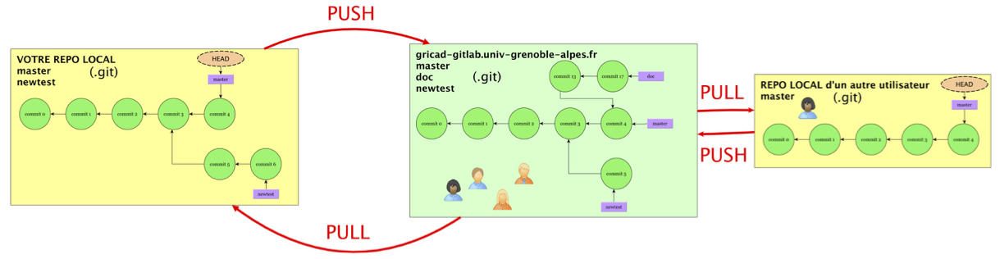

<!-- _class: titlepage -->

<style scoped>
margin-left: 10%;

</style>


# Git & GitLab
## Travailler avec les dépôts distants

### GitLab@CNRS - 11-12/12/2023
#### [Pierre-Antoine Bouttier](mailto:pierre-antoine.bouttier@univ-grenoble-alpes.fr)


---
## Travailler avec les dépôts distants

Jusqu’à présent nous avons utilisé git sur un **seul dépôt**, localement. Nous sommes en mesure de gérer plusieurs lignes de développement (branches), de suivre l’évolution des fichiers, de revenir en arrière etc.

Mais il manque un point essentiel, **la possibilité de collaborer** avec d’autres utilisateurs sur le même projet, éventuellement via le réseau.

Pour cela nous allons **utiliser des dépots distants/remote** : un (ou plusieurs) dépôt/repository, en général hébergé sur un serveur distant mais pas nécessairement, avec lequel vous allez pouvoir échanger des données.

---
## Dépôts distants, principe



* Connexion entre dépôts : ajout ou copie (**clone**) d'un dépôt distant
* Développements indépendants de chaque dépôt
* Intégration des modifs du dépôt distant (**pull**)
* Transfert de vos modifs vers le dépôt distant (**push**)
* Éventuellement, mêmes opérations de la part d'autres utilisateurs

---
## Connexion avec un dépôt distant

Nous avons vu comment créer un dépôt local avec `git init`. 

Une autre façon de créer un dépôt local est de copier un dépôt existant à l'aide de la commande : 
```shell
$ git clone <adresse du dépôt à copier> monprojet
$ cd monprojet
$ git remote # Liste les dépôts distants connectés avec votre dépôt local
```
 Le nom par défaut du dépôt distant est `origin`.

 ---
 ## Compléments sur les dépôts distants

Il est possible de connecter un dépôt distant à un dépôt local **existant** : 
`git remote add <nom dépôt> <adresse dépôt>`

On peut connecter plusieurs dépôts distants à un dépôt local

On peut supprimer la connexion à un dépôt distant : 
`git remote rm <nom local du dépôt distant>`

**Pour aujourd'hui, nous nous en tiendrons à** `git clone`.

---
## Communiquer entre dépôts - git fetch

Dès qu’un dépôt est référencé comme **remote**, vous pouvez synchroniser votre dépôt avec celui-ci. 

La première étape consiste à collecter toutes les infos (données, branches ...) du dépôt distant via la commande `git fetch <nom du dépôt>`:

```shell
$ git fetch origin
```
`git fetch`récupère les données distantes mais ne modifie pas vos branches locales. 

---
## Communiquer entre dépôt - git merge (again)

Ensuite, vous pourrez fusionner une branche distante et une branche locale, avec la commande `git merge NomDépot/NomBranche` comme vu précédemment : 

```shell
$ git merge origin/master
```

Vous avez importé dans votre branche courante (celle depuis laquelle vous avez fait le `git merge`) les modifications de la branche spécifiée du dépôt distant (ici `master`) . 

---
## La vraie commande - git pull

`git fetch` et `git merge` peuvent être combinés en une seule opération :
```shell
$ git pull <nom du dépôt> <nom de la branche>
$ git pull origin master # Par exemple
```

Dans tous les cas, pour un fonctionnement acceptable, il faut un **ancêtre** commun (*i.e.* **commit**) aux différentes branches. 

---
## Connecter branches locales et branches distantes (1/2)

Il est possible (et recommandé !) d’associer/connecter (**tracking**) une branche locale et une branche distante. 

Cette dernière sera dénommée branche “upstream” de la branche locale. Par exemple :
```shell
$ git branch --set-upstream-to=origin/newtest newtest
$ git branch -u origin/master master
```

`--set-upstream`et `-u` désigne la même option. 
Ici, `origin/newtest`est la branche upstream de la branche locale `newtest`. Idem pour `master`. 

---
## Connecter branches locales et branches distantes (2/2)

En spécifiant l'upstream, nous pouvons faire désormais : 
```shell
$ git checkout master # On se place dans notre branche locale master
$ git pull # fetch+merge de origin/master dans master
```

---
## Transférer nos modifications vers le dépôts distants - git push

Dernière étape, le transfert de vos modifications vers un dépôt distant se fait à l'aide de la commande `git push` : 
```shell
$ git push NomDepotRemote branche_locale:branche_distante
```

Ou plus simplement, après avoir connecté vos branches avec des branches upstream :
```shell
$ git checkout master
$ git push # push de master vers origin/master 
```

---
## Encore une autre possibilité

Nous pouvons indiqué une branche upstream au premier push :
```shell
$ git checkout -b newbranch # on crée et on se positionne sur la branche locale newbranch
$ git push 
fatal: The current branch newbranch has no upstream branch.
$ git push -u origin newbranch 
```

---
## En résumé

Le cycle de tavail classique dans un dépôt git :
```shell
$ git clone git@gricad-gitlab.univ-grenoble-alpes.fr:vide/rien.git
$ git branch -u origin/master master
$ git add, commit, status, diff, branch
$ git pull
$ git push
```
[***Go back to Gitlab***](https://stage_urfist_lyon.gricad-pages.univ-grenoble-alpes.fr/git/supports/gitlab.html#27)