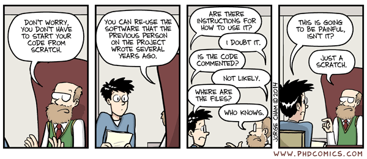

<!-- _class: titlepage -->

 

# Introduction à GitLab
## Cours et mise en pratique

### GitLab@CNRS - 11-12/12/2023
#### [Pierre-Antoine Bouttier](mailto:pierre-antoine.bouttier@univ-grenoble-alpes.fr)

---
# TOC

<!-- _class: cool-list -->

1. *Généralités sur les forges logicielles*
2. *Première connexion sur GRICAD-GitLab*
3. *Les groupes et projets*
4. *Mise en pratique*

---
# TOC

<!-- _class: cool-list -->

1. ***Généralités sur les forges logicielles***
2. *Première connexion sur GRICAD-GitLab*
3. *Les groupes et projets*
4. *Mise en pratique*

---
# Quelques situations rencontrées

---
## Quelques situations rencontrées

---
# Plateformes de développements collaboratifs ou Forges

-  **Forge** : ensemble de logiciels, le plus souvent réunis sur un site web, dont le but est de faciliter la travail collaboratif et la gestion de projets de développement au sens large
- Quelques exemples célèbre : gitlab, github, bitbucket, sourcesup, etc.
- Aujourd'hui, nous utiliserons https://gricad-gitlab.univ-grenoble-alpes.fr

---
# À quoi ça sert ?

- Développement de logiciels, scripts
- Écriture collaborative (ou pas) de rapport, articles, manuscrit de thèse
- Enseignement (cours, matériel pour TP, etc.)
- Génération et déploiement de site web, documentation, notebook, HOWTO
- Quelques mots-clés récurrents : travail collaboratif, mise à disposition, partage, ...

---
# Forge : système de gestion de développement collaboratif

Principe :
- Rassembler des utilisateurs d’horizons différents (chercheurs, ingénieurs, développeurs, coordonnateurs, ...) autour de projets
- Mise à disposition d’un ensemble d’outils adaptés pour gérer les projets

En pratique :
- un site web
- des utilisateurs (login) et des projets
- des outils configurables via l’interface web
- différents niveaux de droits sur les outils et les projets

---
# Les fonctionnalités classiques

* **Gestion de versions** et partage de code (au sens large)
* Gestion électronique de document : édition en ligne, suivi d'historique
* Suivi de problèmes, de tests et intégration continue
* **partage de l'information, liste de diffusion, espace d'échanges**
* **Sauvegarde**
* Hébergement/génération de pages web

--- 
# Pourquoi utiliser une forge ?

Collaboration ”interne” au projet, facilite le travail collectif. 
  * Espace de travail (**git**) et d’échanges (listes de diffusion ...) 
  * Statistiques, activité, état d’avancement du projet. 
  * Collaboration inter-organismes
  * Pérennisation du projet (**sauvegardes**, **doc** ...) 
  
Visibilité , diffusion du projet.
  * Interface de contacts et d’échanges utilisateurs/membres du projet (support en ligne, **documentation**, suivi de bugs ...).
  * Vue sur l’activité, la maturité du projet. 
  * **Téléchargement de code, de documents.**

---
# Pourquoi utiliser une forge ?

La plupart des outils pré-cités sont disponibles indépendamment des forges mais les principaux avantages de celles-ci sont :
* **un accès à tous les outils** via un seul portail web ;
* des outils bien intégrés, **configurables pour chaque projet**, avec une utilisation relativement intuitive ;
* ne nécessite **aucune installation** préalable ;
* un accès **multi-site, multi-users** ;
* une prise en compte des différents **profils d’utilisateurs** (niveaux de droits différents).

---
# Pourquoi utiliser une forge ? 

Utiliser ce genre d’outils permet de faciliter la vie de tout le monde, contributeurs ET utilisateurs (présents et futurs).

**Créer un projet sur une forge devrait être la première étape de tout projet de développement.**

--- 
# Accès à une forge 

GitHub, GitLab.com, Bitbucket, etc. :
- Très fonctionnelles
- Intègrent de nombreux outils
- Grosses communautés 
- Visibilité...
- ...Mais ce ne sont pas des sites académiques : pb de droits, de confidentialité, tutelles pas contentes, pérennité...

---
# Accès à une forge

Pour l’enseignement et la recherche, la tendance est aujourd’hui à la mise en place de plateformes mutualisées dans les organismes de recherche et/ou les communautés. On note également une évolution des outils (passage des forges “à l’ancienne” vers des forges basées sur les logiciels github/gitlab).

Quelques exemples :
* https://sourcesup.renater.fr/ : destinée aux établissements d’enseignement supérieur et aux organismes de recherche français. Basée sur le logiciel fusionforge.
* Différentes forges basées sur le logiciel gitlab: https://gitlab.inria.fr, la forge Huma-num https://gitlab.huma-num.fr/, la forge ESR Grenoble, https://gricad-gitlab.univ-grenoble-alpes.fr... 

---
# Accès à une forge : 

**En pratique**
* Le choix d’une plateforme dépendra de votre projet, des gens impliqués et des habitudes de votre communauté.
* Utiliser plusieurs plateformes n’est en général pas un problème : **leur utilisation est très semblable** et le transfert de projets de l’une à l’autre est relativement simple (au moins pour celles basées sur git).
* Un bon choix (pour les Grenoblois) : gricad-gitlab. Locale (proximité du support), hébergement sur les serveurs universitaires, gratuite...

---
# TOC

<!-- _class: cool-list -->

1. *Généralités sur les forges logicielles*
2. ***Première connexion sur GRICAD-GitLab***
3. *Les groupes et projets*
4. *Mise en pratique*

---
# Accès et connexion

https://gricad-gitlab.univ-grenoble-alpes.fr

- Communauté ESR Grenoble (Onglet **LDAP UGA**): accès complet à tous les outils
- Comptes externes(Onglet **Standard**) : **création de groupes et projets non-autorisés**

---
# Le menu *Settings*

- Le menu *Profile* : renseignez les différents champs
- SSH keys : si vous êtes à l'aise avec les clés SSH
- Notifications : possibilité de paramétrer le niveau de notifications 

--- 
# Où trouver de l'aide ?

https://gricad-gitlab.univ-grenoble-alpes.fr/help

- Quelques pages spécifiques à gricad-gitlab
- La documentation (très complète) fournie par le logiciel gitlab (cf notamment "gitlab basics", "workflow")

---
# Mise en situation

- Connectez-vous avec vos identifiants
- Visitez le menu *Settings*, complétez ce qui vous paraît utile
- Explorez les différents menus/boutons, familiarisez-vous avec l'interface, la doc en ligne, etc.

---
# TOC

<!-- _class: cool-list -->

1. *Généralités sur les forges logicielles*
2. *Première connexion sur GRICAD-GitLab*
3. ***Les groupes et projets***
4. *Mise en pratique*

---

# Projets et Groupes

* **Projet** 
  * Un espace qui vous permettra d'héberger, de sauvegarder et de partager un ensemble de fichiers
  * Un ensemble de participants avec des droits réglables individuellement
  * Une interface de gestion/configuration pour des outils spécifiques au projet

* **Groupe** 
  * Ensemble de projets et/ou de sous-groupes, associés à un ensemble d'utilisateurs

---
# Création de groupes et de projets

À renseigner :
- un emplacement (*namespace*≈dossier) et un nom 
- Une description
- Un niveau de visibilité 
  - privé : visible uniquement par les membres du projet (ajout par l'admin)
  - interne : visible par tout utilisateur connecté (possibilité de demander à rejoindre le projet)
  - public : visible par n'importe qui

**Les projets héritent de la visibilité du groupe.**

---
# Groupes et projets, compléments

- Un projet appartient à un namespace qui peut être :
  - Votre login 
  - Un groupe ou un sous-groupe
- Groupe gitlab = organization github
- Il est possible de demander à rejoindre un projet ou un groupe existant (via le lien **request access**)

---
# Mise en situation

- Une fois connectés à gricad-gitlab, demandez à rejoindre le groupe `git_cnrs`
- Créez un projet `sandbox/votre_login` dans ce groupe et sous-groupe
- Nous regarderons les permissions de chaque membre du projet en détail 

---
# Groupes et projets, bonnes pratiques

* **Ne pas négliger l’étape d’organisation et de nommage des groupes et projets** : on peut très facilement renommer, déplacer un groupe ou un projet mais nécessairement avec un impact sur l’affichage/la visibilité du projet (pages web, références etc).
* **Prenez le temps de configurer correctement** la liste des membres, leurs droits, les rôles, dates d’expiration de participation etc.
* **Membres d’un groupe : n’ajoutez que les personnes susceptibles de participer à tous les projets du groupe.** Dans le cas contraire privilégiez un accès par projet.

---
# Projet, hébergement de fichiers et gestionnaire de version

**Git**Lab : un outil au coeur de la forge et son principal intérêt. 

Projet sur une forge : ensemble de répertoires et de fichiers (**repository/dépôt**) avec un gestionnaire de version intégré

---
<!-- _class: transition -->

Lien entre nos dépôts `git` locaux et Gitlab ?

