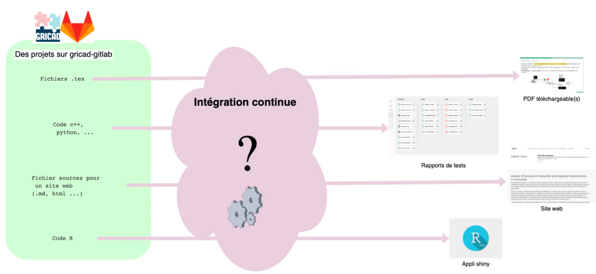

<!-- _class: titlepage -->


# Miscellanées

### GitLab@CNRS - 11-12/12/2023
#### [Pierre-Antoine Bouttier](mailto:pierre-antoine.bouttier@univ-grenoble-alpes.fr)


---

# Le fichier `.gitignore`

---
## Le fichier `gitignore`

Parfois, nous voulons que certains types fichiers ne soient jamais considérés/vus par git : binaires, `*.pyc`, fichiers temporaires, etc.

Le fichier nommé `.gitignore` permet d'indiquer les fichiers à ne pas considérer.

**Attention** : si des fichiers décrits dans le .gitignore sont déjà suivis par git, ils le resteront.

---
## Le fichier `.gitignore`

On peut avoir un `.gitignore` valable pour tous nos dépôts locaux 
```shell
$ git config --get core.excludesfile <chemin vers le .gitgnore>
$ ... # éditer et sauver le .gitignore au chemin indiqué au-dessus
```
Ou à la racine de chaque dépôt. Il sera valable pour tous les sous-dossiers du dépôt.

Dans chaque sous-dossier, vous pouvez également sauvegarder un `.gitignore` qui s'appliquera à ce sous-dossier et aux répertoires enfants.

[Quelques modèles de `.gitignore`](https://github.com/github/gitignore)


---

# Les alias Git

---
## Toujours les mêmes commandes à taper...

Si vous utilisez git régulièrement, vous verrez que vous ferez sans cesse les mêmes commandes. 

On peut définir des alias aux commandes que vous utilisez le plus : ce sont des commandes raccourcies. Par exemple : 
```shell
$ git cm "..." # alias de git commit -m "...
```

---
## Définition des alias

Pour définir, vos alias, vous pouvez éditer le fichier `~/.gitconfig`, en ajoutant, par exemple : 
```git
[alias]
  a = add --all
  b = branch
  c = commit
  ca = commit -a
  cm = commit -m
  cam = commit -am
  o = checkout
  ob = checkout -b
```
---

# La commande `git diff`

---
# La commande `git diff`

La commande git diff permet de comparer n’importe quelle version d’un fichier avec n’importe quelle autre.

Différence entre la version indexée et la version modifiée :
```shell
git diff monFichier
```
Différence entre la version indexée et la version de référence
```shell
git diff --staged nomFichier
```
Différence entre la version courante et celle d'un commit précédent
```shell
git diff d18e05e80fe11c6206e2cb5a0624b477a6c31226 monFichier
```


---

# Le langage markdown

Le Markdown est un langage très simple à apprendre, à lire et à écrire qui permet de formater du texte pour une page web. Sur Gitlab vous pouvez utiliser une version étendue du Markdown (gitlab flavored markdown) pour rédiger vos commentaires, issues, fichier d’aide etc.

Documentation
- https://docs.gitlab.com/ee/user/markdown.html
- https://github.com/adam-p/markdown-here/wiki/Markdown-Cheatsheet

---
## Le langage Markdown

**L'apprentissage de l'écriture en markdown** est très rapide. Prenez ce temps, vous verrez que c'est à la fois très pratique et très utilisé. 

Les avantages du markdown :
* Basé sur des fichiers textes bruts, donc très interopérables (contrairement aux .doc, .docx, par exemple), et facile à mettre dans un dépôt git/gitlab.
* Des règles très simples
* Facile à convertir : html, pdf, jpg, png, etc...

---
## Le langage markdown

* Au cours de la formation, vous avez pu voir des fichiers dont le nom se finissait par `.md` : c'est l'extension par défaut pour le markdown. 
* Un fichier markdown est un fichier texte brut avec quelques règles syntaxiques.
* Si vous écrivant un document markdown dans votre dépôt gitlab, Gitlab l'affichera formatté. 
* Il est très conseillé, pour chaque projet git/gitlab, d'écrire un fichier README.md qui décrira le projet et ce qu'il y a savoir à son propos.

---
## Le langage markdown

```markdown
# Titre de niveau 1

*Pour écrire en italique*, **pour écrire en gras**, ~~du texte barré~~.

## titre de niveau 2

voici une liste : 
- Élément 2
- Élément 1

### Titre de niveau 3

Une liste ordonnée : 
1. Élément 1
2. Élément 2
```

Les supports de ce stage sont intégralement écrits en markdown. 

---

# Les licences (logicielles)

---
## Les licences (logicielles)

Si vous publiez/diffusez votre code/un rapport/site web, il est important d'établir un **contrat** entre **vous**, son créateur, le **propriétaire** du code (souvent l'employeur, dans le cadre professionnel) et les **utilisateurs**. C'est le rôle de la **licence**.

Il y a les licences logicielles (GPL, MIT, BSD, CeCiLL, etc.) et les licences plus larges (Creative Commons). Chaque licence peut avoir (et a souvent) des déclinaisons. Il y a des libres, open-source, propriétaires...

Bref, c'est compliqué. Dans la recherche, les instituts fournissent des directives à appliquer. Rapprochez-vous des services juridiques pour en savoir plus. 

---
## Les licences (logicielles) - En pratique

Autant il peut être compliqué de savoir quelle licence utiliser, autant il est très facile d'ajouter un fichier de licence à votre projet Gitlab.

**Voir démo**

[Un document sur les licences logicielles qui peut être très utile](fig/INRIA_recueil_fiches_licences_libres_vf-4.pdf)

---

# Les issues

---
## Les issues Gitlab, gestionnaire de problème et d'échanges

Le gestionnaire de problème est un outil standard des forges qui permet le suivi efficace de l’évolution des bugs (du signalement à la résolution), mais aussi de proposer, de discuter de nouvelles idées, de suivre l’ajout de nouvelles fonctionnalités, leur évolution (dans des branches).

Bref, c’est un outil indispensable à la vie du projet, qu’il faut exploiter. Il est accessible via le menu Issues, avec en particulier :
* List et Board pour visualiser l’ensemble des problèmes déja déposés, les classer, les commenter ... 
* Milestones : définition d’étapes de développement, planification du projet

---
## Conseils et fonctionnalités utiles sur les issues

* Créez des labels explicites pour classer vos issues (documentation, bugs, newideas...).
* Utilisez le markdown pour rédiger vos issues. 
* Vous pouvez mentionner dans les issues ou dans les messages de commit les autres participants au projet via la chaine @username. Cela entrainera l’envoi d’un mail à la personne concernée, l’ajout d’une tâche dans sa todo-list
* faire référence à une issue dans une autre issue ou un message de commit via `#id`, id étant le numéro de l’issue
* clore automatiquement une issue via un message de commit. Il suffit qu’il contienne la chaîne `Fix #id` (ou un des autres mots-clés mentionnés ici :
https://docs.gitlab.com/ee/user/project/issues/automatic_issue_closing.html).

---
# Fork et merge-requests - Divergence et demande de fusion

Jusqu’à présent, **nous avons tous travaillé dans le même dépôt (sandbox)**, et à la toute fin, sur la même branche `master`.

En principe, **il vaut mieux réserver la branche master pour la version principale et stable du projet**, et **isoler** les essais/implémentations de nouvelles fonctionnalités, corrections d’un bug etc., dans des **branches**. 

**Si vous n'êtes pas dans le projet**, mais que vous souhaitez proposer des améliorations, des corrections, bref, contribuer, Gitlab propose un mécanisme pour gérer proprement ces développements parallèles : **les merge-requests ou demandes de fusion (pull requests sous github).**

---
## Comment procéder pour faire une merge-request ? - le fork

Si vous voulez contribuer à un projet mais que vous n'en êtes pas membre : 
* vous pouvez le cloner localement
* Faire des modifs dans votre dépôt local
* `git pull`
* `git push` : erreur, vous n'avez pas les droits de contribuer. 
* Il faut donc passer par **un fork**

---
## Comment procéder pour faire une merge-request ? - le fork

Le fork est **une copie d'un projet gitlab** dans un espace de noms où vous avez les droits pour contribuer.

**Voir démo**

---
## Comment procéder pour faire une merge-request ? - le workflow

### De votre côté 

1. On forke le projet visé
2. on clone localement le dépôt associé au fork, on fait nos modifs et nos commits, que l'on push dans le projet forké. 
3. Quand on a un commit qui nous semble OK pour contirbuer au projet visé, on va faire une **demande de fusion** (menu gauche du projet forké)

### Côté projet principal

1. On fait une revue de la demande de fusion
2. On la rejette ou on l'intègre


---
# L'intégration continue

---
## Qu'est ce que c'est ?

**Concept** : l’intégration continue (CI) est une pratique consistant à vérifier systématiquement l’impact de toute modification du code source sur le fonctionnement, les performances, etc. par la mise en place d’une chaine d’exécution automatique contenant par exemple des ”tests”.

* Permet de produire un code stable, robuste et portable. 
* Permet de s’assurer que le résultat de nouvelles modifications n’introduit pas de régression du code
* Permet d’anticiper différents types d’utilisation du code.
* Permet de faciliter les développements au quotidien.

**Comment** : Des outils tels que github ou gitlab proposent un outil d’intégration continue simple à utiliser et très fonctionnel.

---
## Par quelle magie ?

À chaque push vers le serveur, des tâches pré-définies par les développeurs sont exécutées.


---
## Quelques exemples



Ici, il y a du **déploiement continu** aussi. Mais les mécanismes sont les mêmes que pour la CI. Seule la finalité change.

---
## Comment mettre la CI/CD en place ? 

* Il suffit de créer un fichier nommé `.gitlab-ci.yml`à la racine du dépôt du projet
* Dès que ce fichier est présent, l’intégration continue est activée. Ce fichier contient la liste des tâches à effectuer : quelles actions, sur quelles machines etc.
* Définir des ***runners*** : une ou plusieurs machines (éventuellement virtuelles) sur lesquelles seront exécutés les jobs d’intégration continue.

https://docs.gitlab.com/ee/ci/quick_start/

**Voir démo**